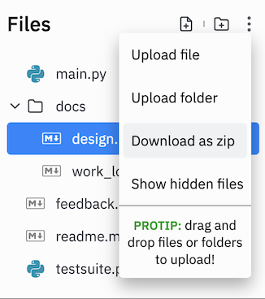

## CSC 111: Final Project Information

**Learning Objectives**: The goal of the final project is to apply the techniques we’ve learned in this class to something you care about. Your final project should be substantial (i.e., the size of ~3 homework assignments), and demonstrate most, if not all, concepts from the course. In addition to writing code, you are also required to complete design and reflection activities and keep a record of your work. This will give you a better sense of what is involved in writing software and computer science. 

Projects must be completed in groups of 2-4. 

### Ideas:

* a computer-generated animation
* a tool to help plan your path through the major
* a poem generator 
* a choose-your-own-fractal program 
* a graphing calculator program 
* an education program to teach kids/students math, chemistry, physics, economics
* a game/tool to help new people learn more about Smith or your house
* a tool to find the best meal on campus
* a custom game
* anything else you can think of!

### Final Project Deliverables
| What's Due | Deadline  | 
|---------------------------------------------------|------------------------------------------------------------|
| Final Project - Proposal | Thursday, March 10, 2022 | 
| Final Project - Prototype I | Thursday, April 07, 2022 | 
| Final Project - Prototype II | Thursday, April 21, 2022 | 
| Final Project - Prototype III | Tuesday, April 26, 2022 (_Note: This is Tuesday._) | 
| Final Project - Demo Day | Wednesday, April 27, 2022 12:05pm-1:20pm (_Note: This is during lunch._) | 
| Final Project - Final Submission, Video, and Reflection | Thursday, May 05, 2022  **NO EXCEPTIONS** |

---
<!--
## Project Proposal

_Note: Students who would like to complete the project alone, may petition the course instructor **prior to March 7th** for approval._

As a group, you should write a short proposal (<= 1 page).

Your proposal should include the following information:

* Names, Emails, Replit Names of all the people working on this project.
* A Project Title or Group Name.
* What's the *big idea* behind this project? (max 1000 characters)
* What are the *(major) building blocks* the project will need to be successful? (max 1000 characters)
* Which do you *know how to build already*, and which ones do you *still need to figure out*? (max 1000 characters)
* Are there any *potential roadblocks*? (max 500 characters)
* Determine weekly time blocks when all group members can meet (minimum 3 hours over the week). (max 500 characters)

You should write your answer in a shared doc and then when you are ready, submit them via the Google form. 

_Note: All group members must be registered in the same section._

*** ONLY ONE PERSON FROM EACH GROUP NEEDS TO SUBMIT ***   
**Project Proposal Submission Form: [https://forms.gle/KwuTqxQpKN4S17Mb9](https://forms.gle/KwuTqxQpKN4S17Mb9)**

---
-->

## Project Requirements

* Your completed project should meet the learning objectives described above. You will be evaluated on the final product as well as the quality of your code. 
* You are required to comment your code and provide doc strings for every function and class.  
* You should create "Unit Tests" in testsuite.py to evaluate your functions with return values. _Note: `testsuite.py` replaces the `Replit Unit Tests` from previous assignments. Now we give you the power to make your own tests.
* Your program should run from main.py, by clicking the run button in Replit.
* You are permitted to use additional `import` commands in the project. Any code that is imported, you must be able to explain how it works.
* You are permitted to use additional algorithms and modules outside the scope of this course. Any copied code block must be surrounded by a comment block with the original citation. The reference must be listed both with the code block and in the references at the start of the file.
* You are permitted to add additional files to your repository. The course header must be added to every `.py` file.
* If you add more than one image to your repository, create an `images` folder and store all images in the folder.

You are also required to submit other supporting documents:

1. `feedback.md`: Update this file with the appropriate information about your team and its members. We will leave comments in this file at each milestone (i.e., Prototype submission).
2. `readme.md`: [A basic readme file](https://en.wikipedia.org/wiki/README) including:

    * team information
    * a list of all files required/included in your project, and a description of their contents
    * an explanation of how to run and interact with your project (similar to a user guide)

3. `work_log.md`: This file documents the contract and progress of your group, including:

    * A completed group contract following the template
    * A record of every meeting and co-working session, including what you accomplished

4. `design.md`: This file documents the higher-level plans for your project, including:

    * a plan for each sprint (i.e., time between Prototypes) 
    * a "user persona", includes a short description of a hypothetical person for whom the project is being designed including their relationship to technology, and their motivation (why do they want to interact with your project?)
    * a diagram/description of how individual components of the project are connected and interact with each other 
    * a rubric for how you think your project should be graded in terms of both implemented features and good coding/design practices
    
5. Additionally, you are also required to submit a video of your project and a personal reflection, as well as attend demo day. See below for details.

---

## Final & Prototype Submissions

For each submission, submit your completed project files on Moodle as a `.zip` file exported from Replit (click the 3 vertical dots next to `Files`, then `Download as .zip`).

For each submission, you should include all files required to run your code, a `readme.md` with information to run the project in its current state, a completed work log up to the date of submission, a test suite for your implemented code, and a design document based on what we have covered in class.

For each Prototype submission, your design document must include a bulleted list of what parts you have completed and what parts you will complete for the next submission.

For Project Prototype I you will submit your [minimum viable product](https://en.wikipedia.org/wiki/Minimum_viable_product). This should include the core functionality to demonstrate the purpose of your project.

For Project Prototype II you will submit a basic version of the completed project as it would be for [beta testing](https://en.wikipedia.org/wiki/Software_testing#Beta_testing).

For Project Prototype III you will submit a the completed project.

For Final Submission you will submit your completed project with any enhancements or bug fixes from demo day. All files must be complete at this point.

*** ONLY ONE PERSON FROM EACH GROUP NEEDS TO SUBMIT ***

---

## Project Video

Create a 2-4 minute video of your Final Project. The video should demonstrate the features of your project (i.e., the end product rather than the code base). A screencast of someone using the tool with an audio explanation is sufficient.
You should complete the video as a group, and only one video per project group will be accepted.
Please **do not** add music as background to your video. 
Submit your video on Moodle, do not upload it to your Replit!

By submitting a video you give permission to Smith College and your course instructors to use and post your video for future versions of CSC111 and other introductory CS courses.   
If you do not wish to give permission, please contact Prof. Grubb.

*** ONLY ONE PERSON FROM EACH GROUP NEEDS TO SUBMIT ***

---

## Project Presentations

The project presentations will be in-person (see date above). 
Each group must attend with the code working on their machine and be able to demonstrate the program.
All members of the group will be required to present for half of the time and will spend the other half of the time seeing other groups presentations.
Exact instructions will be given the week before the presentation.

*** ALL STUDENTS MUST ATTEND THE PROJECT PRESENTATIONS FOR CREDIT ***

---

## Project Reflection

Write a 1-2 page reflection (to be completed independently, without consulting your group) on the project and how it went. You should include:

* a description of your specific contributions to the project.
* a **work diary** of what dates and for how long you worked on the project and with whom.
* a reflection on to what extent you collaborated well with your group. 
* *a discussion of what problems you experienced, and what you learned as a result*
* advice for students/groups completing this project in the future.

Submit your <= 2 page reflection as a .pdf on Moodle.

*** ALL STUDENTS MUST SUBMIT ***

